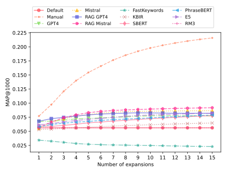
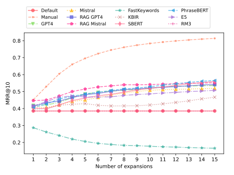
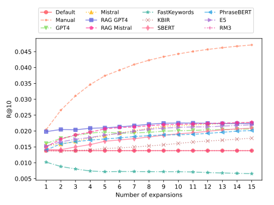
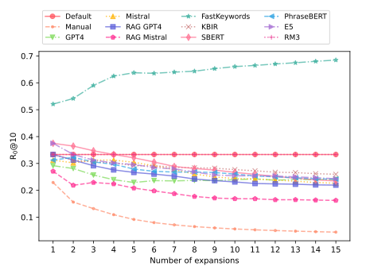
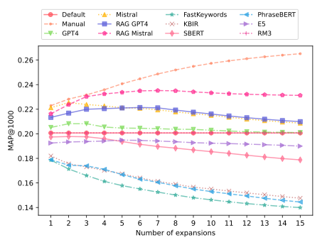
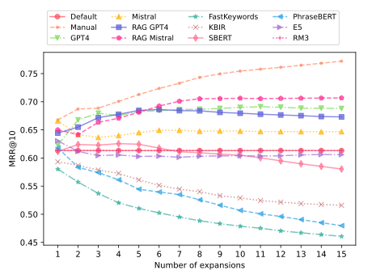
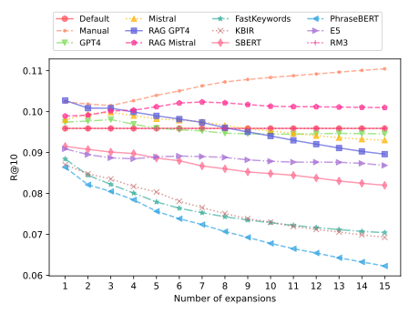
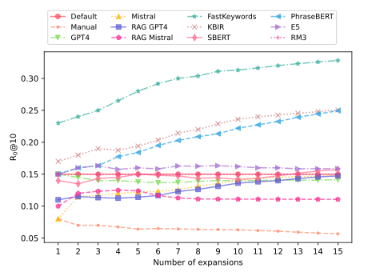

<div id="readme-top"/>

<!-- PROJECT LOGO -->
<br />
<br />
<div align="center">
  <p>
    
  </p>

<h3 align="center">RAKS: Retrieval-Augmented Keyphrase Suggestion</h3>
  <em align="center">
    Leveraging Retrieval-Augmented Generation for Keyphrase Synonym Suggestion
  </em>
</div>

## Getting Started

Here we enumerate the requisites to get the evaluation code running correctly.

1. Setup pyterrier (installation guide at their [repo](https://github.com/terrier-org/pyterrier))
2. Install the remaining dependencies
3. Index both TREC Fair 2021 and Disks 4 & 5 documents (in two different indices)
4. Generate the two jsonl files with the TREC topics, fields should be: `(title, keywords, rel_docs)`

<p align="right">(<a href="#readme-top">back to top</a>)</p>

## Usage

### Reproducibility

Here, we show how to reproduce the results of our experiments. For that we just need to use the synonyms files provided within the code and run the evaluation script as follows.

```
python eval.py
```

In the casse you want to reproduce TREC 7_8 experiments you only have to change the `DATASET` constant.

### Replicability

Steps to replicate the experiments presented on the paper:

1. Generate keyphrases for the TREC collections (_scripts available soon_).
2. Index the keyphrases and their embeddings (_scripts available soon_).
3. Generate the keyphrases synonyms for each method.
4. Run the evaluation.

Here we provide the scripts for the last two steps:

```
python gen_synonyms.py
python eval.py
```

<p align="right">(<a href="#readme-top">back to top</a>)</p>

## Results

### TREC Fair 2021

<div style="display: flex; justify-content: space-between;">
  
  
</div>

<br>

<div style="display: flex; justify-content: space-between;">
  
  
</div>

### TREC 7 8

<div style="display: flex; justify-content: space-between;">
  
  
</div>

<br>

<div style="display: flex; justify-content: space-between;">
  
  
</div>

<br>

<p align="right">(<a href="#readme-top">back to top</a>)</p>

## License

Distributed under the MIT License. See `LICENSE.txt` for more information.

<p align="right">(<a href="#readme-top">back to top</a>)</p>
